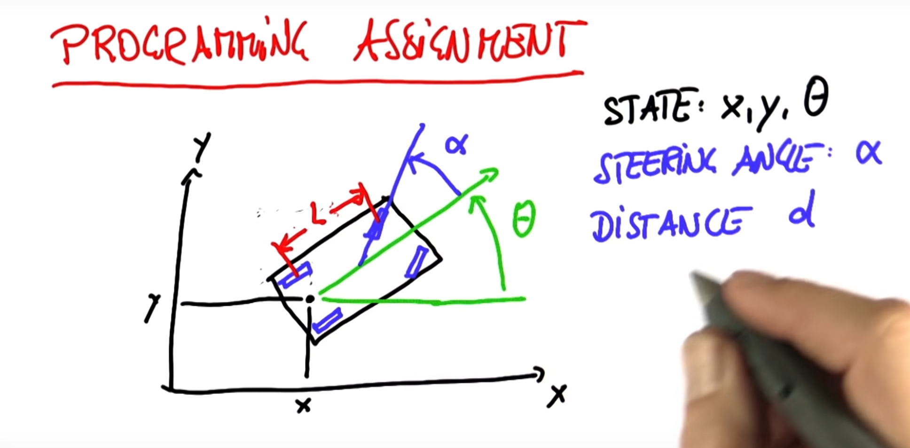
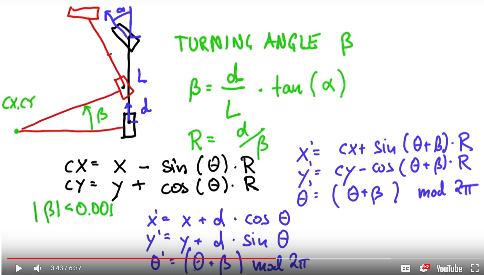

##Bicycle Model
We treat a car like a bicycle by 'averaging' the left and right side; like it was a bicycle with a big car body on it.  So the 'virtual' back wheel is midway between the two actual back wheels.  The 'virtual' front wheel is midway between the two front wheels and turns the same as they do.

### Mechanical constants for the vehicle
- **L** is wheel base from back wheel to front wheel

### Vehicle State
- **x** is the horizontal (east/west) the position of the back wheel in the world.
- **y** is the vertical (north/south) the position of the back wheel in the world.
- **θ** (theta) is the heading of the car in the world.  θ is zero when the car is headed directly east.



### Vehicle movement
- **α** (alpha) is the steering angle of the front wheels relative to straight
- **d** is the distance the back wheels move
- **cx, cy** is the center of the turn
- **β** is the change in heading
- **R** is the turning radius



The heading change is a function of the steering angle, the distance travelled and the wheel base:
```
    β = d / L * tan(α)
```

The turning radius is a function of the distance travelled and the heading change:
```
    R = d / β
```

The center of the turn is a function of the cars position, heading and turning radius:
```
    cx = x - sin(θ) * R
    cy = y + cos(θ) * R
```

After a move, we update the state based on the heading change:
```
    x' = cx + sin(θ + β) * R
    y' = cy - cos(θ + β) * R
    θ' = (θ + β) mode 2π
```

To avoid a divide by zero in the calculation of the turning radius, for very small β (β < 0.0001) we treat the movement as straight forward:
```
    x' = x + d * cos(θ)
    y' = y + d * sin(θ)
    θ' = (θ + β) mode 2π
```


